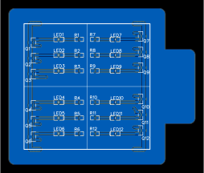
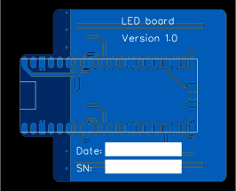

# Lamp board

A PCB that holds the electronics for the lamp. It is designed to fit inside the base of the lamp stand.

The board has 3 red, 3 green and 3 blue LEDs, each controlled by FET driven by a separate GPIO lines. The intention is to drive the LEDs with PWM to create a wide range of colours.

A Raspberry Pi Pico micro-controller board is mounted on the bottom of the PCB. The Pico is powered from USB. Firmware could be written to control the LEDs independantly or from commands send from a computer of USB. A Pico-W could be used instead of a Pico to allow the lamp to be controlled over WiFi or Bluetooth.

TODO: Add photo of completed board

## Licence

Copyright © 2023 Phil Baldwin

This work is licensed under a Creative Commons Attribution-ShareAlike 4.0 International License.

You should have received a copy of the license along with this work. If not, see <http://creativecommons.org/licenses/by-sa/4.0/>.
